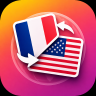

  

  # Vocadeck

  **Apprends du vocabulaire dans plus de 40 langues, à ton rythme.**

  
  
  
  

---

  
  
<em>Plume, la mascotte de Vocadeck, te guide dès le premier lancement.</em>

## Présentation

Vocadeck est une application de flashcards conçue pour apprendre du vocabulaire par **répétition espacée** — l'app décide pour toi quand réviser chaque mot, juste avant que tu risques de l'oublier. Le moteur de planification est **FSRS-4.5**, l'algorithme qu'Anki lui-même a adopté par défaut en 2023, avec un objectif de mémorisation réglable et des poids qui peuvent s'optimiser automatiquement sur ton propre historique de révisions.

Le contenu est rédigé en français/anglais puis rendu disponible hors-ligne dans plus de 40 langues grâce à un pipeline de traduction pré-cuite (qualité DeepL sur les langues courantes, complété par un moteur de traduction local) — aucune connexion n'est nécessaire pour réviser.

## Fonctionnalités principales

- 🧠 **Répétition espacée FSRS-4.5** — objectif de mémorisation réglable, étapes d'apprentissage courtes pour les nouvelles cartes, poids personnalisables via un optimiseur 100 % local
- 📚 **~875 decks prêts à l'emploi**, classés par thème, pré-traduits pour un import instantané et hors-ligne
- 🎮 **Mini-jeux de révision** — Scrabble, Trouve l'erreur, Trouve la bonne traduction, Associe les mots mélangés, Le pendu, Contre-la-montre…
- 🗂️ **Sous-catégories** (jusqu'à 3 niveaux) et **cartes de révision libres** (hors traduction)
- 🌍 **Traduction automatique** à la création de carte, avec repli hors-ligne sur les dictionnaires pré-cuits avant tout appel réseau
- 🔊 **Synthèse vocale** pour chaque mot et **reconnaissance vocale** pour vérifier ta prononciation
- 🖼️ **Images associées aux cartes** (recherche automatique d'illustration)
- ☁️ **Synchronisation multi-appareils** via Firebase (compte invité anonyme ou connexion Google)
- 🎨 **Thèmes Papyrus (clair) / Nocturne (sombre)**, plusieurs polices
- 📱 **Widget écran d'accueil** Android, mise en page adaptée aux tablettes
- 📤 **Import/export CSV** et **import Anki (.apkg)**
- 🔒 Aucune publicité, aucune vente de données — voir la [politique de confidentialité](https://deodexer.github.io/vocadeck/privacy-policy_fr.html)

## Installation

> L'application n'est pas encore publiée sur le Play Store, et son code source n'est pas public.
> Ce dépôt héberge uniquement les informations destinées au public : cette présentation et la [politique de confidentialité](https://deodexer.github.io/vocadeck/privacy-policy_fr.html).

## Guide d'utilisation

### Écran principal

L'écran d'accueil liste tes cartes, regroupées par **catégories** (blocs colorés, dépliables en sous-catégories).

| Geste | Action |
|-------|--------|
| Appui sur un bloc de catégorie | Lancer une session avec les cartes de cette catégorie |
| **Appui long sur un bloc de catégorie** | Modifier le nom ou la couleur de la catégorie |
| Appui sur une carte | Ouvrir la carte pour la modifier |
| Bouton + (bas droite) | Créer une nouvelle carte |
| Filtres Difficile / Normal / Facile | Lancer une session filtrée par niveau |

### Session de révision

Une session affiche les cartes une par une en plein écran.

| Geste | Action |
|-------|--------|
| Appui sur la carte | Retourner la carte (voir la traduction) + écouter la prononciation |
| Glissement | Passer à la carte suivante / précédente |
| **Appui long sur la carte** | Ouvrir l'écran de modification |

Après avoir retourné la carte, trois votes sont proposés — **Difficile**, **Normal**, **Facile** — qui pilotent directement le prochain intervalle de révision calculé par FSRS.

### Menu latéral

Accessible depuis l'icône en haut à gauche de l'écran principal.

| Option | Description |
|--------|-------------|
| Decks prêts à l'emploi | Parcourir et importer le catalogue de decks pré-traduits |
| Statistiques | Suivi de tes révisions |
| Corbeille | Restaurer une carte ou catégorie supprimée |
| Confidentialité | Renvoie vers la politique de confidentialité publiée sur GitHub Pages |
| Signaler un bug | Formulaire de rapport intégré |
| Notes de version | Historique des mises à jour |
| Se déconnecter | Synchronise les données puis déconnecte |
| Vider toutes les données | Supprime cartes et catégories sans fermer le compte |
| Supprimer mon compte | Suppression RGPD complète (données + compte) |

### Compte et synchronisation

- Au premier lancement, un **compte invité anonyme** est créé automatiquement (aucune inscription requise)
- Pour synchroniser sur plusieurs appareils : **Lier avec Google** dans le menu latéral
- Les données locales sont automatiquement poussées vers le cloud avant déconnexion

## Architecture technique

| Couche | Technologie |
|--------|-------------|
| UI | Flutter / Material 3 |
| État | Riverpod |
| Base locale | Drift (SQLite) — source de vérité, hors-ligne d'abord |
| Cloud | Firebase Firestore + Auth + App Check |
| Répétition espacée | FSRS-4.5, poids personnalisables (optimiseur local) |
| Traduction runtime | MyMemory (repli), dictionnaires pré-cuits DeepL/NLLB hors-ligne |
| Voix | Synthèse vocale + reconnaissance vocale du système |
| Images | Recherche d'illustration (Pexels / Pixabay) |

## Confidentialité

La politique de confidentialité complète, disponible dans les 27 langues de l'application, est publiée sur GitHub Pages :
**[deodexer.github.io/vocadeck](https://deodexer.github.io/vocadeck/privacy-policy_fr.html)**

## Licence

Projet personnel — tous droits réservés.
